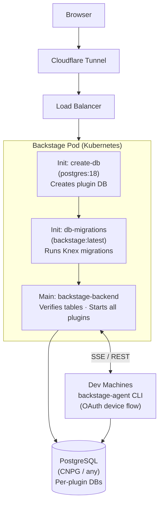

# Nexus IDP

Stratpoint Engineering's Internal Developer Platform, built on [Backstage](https://backstage.io). Nexus IDP integrates FinOps cost management, Engineering Docs, K8s + ArgoCD monitoring, user onboarding/management, and a Local Provisioning system for spinning up local infrastructure via Docker Compose.

**Version:** 1.49.1 | **Node.js:** 20.x or 22.x | **Package manager:** Yarn 4.12.0 (Berry PnP)

---

## About the Logo

The Nexus mark is a stylized **N** composed of two structural strokes that cross through each other — one running top-left to bottom-right, the other bottom-left to top-right. Neither is a simple diagonal; both carry deliberate weight and form, and their crossing creates a sense of intersection and flow.

The mark communicates three ideas:

- **Connectivity** — two paths meeting, like systems and teams connecting through a central platform
- **Duality** — two directions, two strokes, suggesting the portal bridges worlds: developer and platform, local and cloud
- **Movement** — the diagonal energy implies things in motion, not a static registry

The name *Nexus* itself means *a connection or series of connections linking two or more things* — the mark reinforces this visually. The strokes don't merely cross; they interlock. For an Internal Developer Platform, that's the point: Nexus IDP is the connection point between engineers and infrastructure.

---

## Table of Contents

- [About the Logo](#about-the-logo)
- [Architecture](#architecture)
- [Custom Plugins](#custom-plugins)
  - [User Onboarding & Lifecycle](#user-onboarding--lifecycle)
  - [Local Provisioner Database](#local-provisioner-database)
- [Local Development](#local-development)
- [Production Deployment](#production-deployment)
  - [Kubernetes (Talos / Generic)](#kubernetes-talos--generic)
  - [Docker Compose (Single Host)](#docker-compose-single-host)
  - [Other Platforms](#other-platforms)
- [Environment Variables](#environment-variables)
- [Database Setup](#database-setup)
- [Build & Image](#build--image)
- [Common Operations](#common-operations)
- [Troubleshooting](#troubleshooting)
- [Documentation References](#documentation-references)
- [Project Structure](#project-structure)

---

## Architecture



**Auth:** Google OAuth (primary) + GitHub OAuth (secondary), restricted to org domain via `organization.domain`
**Permissions:** Three-tier RBAC:

| Tier | Group | Access |
|------|-------|--------|
| Admin | `backstage-admins` | Full access — manage users, delete entities, all scaffolder templates |
| Engineer | Any dept team (web-team, mobile-team, etc.) | Read, create, scaffolder |
| New / Trainee | `general-engineers` only | Read-only — restricted sidebar, redirected to `/onboarding` |

---

## Custom Plugins

| Plugin | Location | Purpose |
|--------|----------|---------|
| `finops-backend` | `plugins/finops-backend/` | AWS cost data — Cost Explorer, Budgets, EC2/RDS/ELB/S3 resources, multi-account |
| `finops` | `plugins/finops/` | Frontend FinOps dashboard — cost overview, budgets, unused resources, recommendations |
| `engineering-docs-backend` | `plugins/engineering-docs-backend/` | MDX documentation served from GitHub repositories |
| `engineering-docs` | `plugins/engineering-docs/` | Frontend engineering docs viewer with TOC and nav sidebar |
| `user-management-backend` | `plugins/user-management-backend/` | User DB, team assignment, GitHub linking, session revocation, org entity provider |
| `user-management` | `plugins/user-management/` | Admin UI — list users, assign teams, promote/demote admins, remove users |
| `onboarding` | `plugins/onboarding/` | New user onboarding flow — registration form, GitHub connect, guided steps |
| `local-provisioner-backend` | `plugins/local-provisioner-backend/` | Task queue, SSE stream, agent management, device code auth |
| `local-provisioner` | `plugins/local-provisioner/` | Frontend UI — task list, agent status |
| `project-registration` | `plugins/project-registration/` | Project wizard UI (backend not yet implemented) |
| `backstage-agent` | `packages/backstage-agent/` | CLI agent — runs on dev machines, executes provisioning tasks |
| `DeviceAuthPage` | `packages/app/src/components/` | Browser-side UI for the OAuth device code flow (`/device` route) |
| `CustomTechRadarPage` | `packages/app/src/components/techRadar/` | Thoughtworks Tech Radar with auto-detected latest volume |

### User Onboarding & Lifecycle

All new users are **auto-provisioned** on first sign-in:

1. User signs in with Google OAuth (`@<org-domain>`)
2. `google-auto-provision` module issues a token with `general-engineers` membership (no catalog entity needed)
3. User is redirected to `/onboarding` — restricted sidebar (Onboarding, Catalog, Docs, Tech Radar only)
4. User completes 5 onboarding steps: register (select dept team) → link GitHub → catalog tour → engineering docs → project creation
5. After registering, `UserEntityProvider` creates/updates their catalog entity within ~30 seconds
6. Their token refreshes with the real dept-team membership → full sidebar unlocks

**Teams:**

| Team ID | Label | Notes |
|---------|-------|-------|
| `general-engineers` | No team yet — Intern / Trainee | Default for all new/unregistered users; restricted access |
| `web-team` | Web | |
| `mobile-team` | Mobile | |
| `data-team` | Data | |
| `cloud-team` | Cloud | |
| `ai-team` | AI | |
| `qa-team` | QA | |

**Auth modules** (both use `organization.domain` from `app-config.yaml`):
- `google-auto-provision` — restricts sign-in to `@<domain>` emails; auto-provisions new users with `general-engineers`
- `github-email-enforcement` — requires a verified `@<domain>` email on the GitHub account before allowing GitHub OAuth sign-in

### Local Provisioner Database

The local-provisioner plugin uses its own database: `backstage_plugin_local-provisioner` (note the **hyphen**, not underscore — it follows the plugin ID).

Tables created by migrations:
- `provisioning_tasks` — task queue with status tracking
- `agent_registrations` — registered agent registry

Migrations are plain JavaScript (CommonJS) files in `plugins/local-provisioner-backend/src/database/migrations/` and are run by the `db-migrations` init container, **not** by the main app at startup.

---

## Local Development

### Prerequisites

- Node.js 20.x or 22.x
- Yarn 4.12.0 (`corepack enable && corepack prepare yarn@4.12.0 --activate`)
- Docker & Docker Compose

### Setup

1. **Start local services:**
   ```bash
   docker compose up -d
   ```
   This starts PostgreSQL (port 5432) and Redis (port 6379).

2. **Run local migrations** (first time or after adding migrations):
   ```bash
   node scripts/run-migrations.js
   ```
   Requires `POSTGRES_*` env vars set (see `.env` setup below).

3. **Create `app-config.local.yaml`** for local overrides (not committed):
   ```yaml
   app:
     baseUrl: http://localhost:3000

   backend:
     baseUrl: http://localhost:7007
     cors:
       origin: http://localhost:3000

   auth:
     environment: development
     providers:
       google:
         development:
           clientId: ${AUTH_GOOGLE_CLIENT_ID}
           clientSecret: ${AUTH_GOOGLE_CLIENT_SECRET}
   ```

4. **Set environment variables** — create a `.env` file or export:
   ```bash
   export POSTGRES_HOST=localhost
   export POSTGRES_PORT=5432
   export POSTGRES_USER=backstage
   export POSTGRES_PASSWORD=backstage
   export POSTGRES_DB=backstage_plugin_local-provisioner
   export AUTH_GOOGLE_CLIENT_ID=<your-client-id>
   export AUTH_GOOGLE_CLIENT_SECRET=<your-client-secret>
   export BACKEND_SECRET=<32-byte-hex>   # node -p 'require("crypto").randomBytes(32).toString("hex")'
   export GITHUB_TOKEN=<your-pat>
   ```

5. **Install dependencies and start:**
   ```bash
   yarn install
   yarn dev
   ```
   Frontend: http://localhost:3000 | Backend: http://localhost:7007

### Available Scripts

| Script | Description |
|--------|-------------|
| `yarn dev` | Start frontend + backend in development mode |
| `yarn start` | Frontend only |
| `yarn start-backend` | Backend only |
| `yarn build:backend` | Build backend for production |
| `yarn build:all` | Build everything |
| `yarn tsc` | TypeScript type check |
| `yarn lint:all` | Run linter |
| `yarn test` | Run tests |

---

## Production Deployment

### Kubernetes (Talos / Generic)

This is the primary production deployment method.

#### Prerequisites

- Kubernetes cluster (tested on Talos Linux)
- `kubectl` and `helm` configured
- PostgreSQL accessible from the cluster (tested with [CloudNativePG](https://cloudnative-pg.io/))
- A container registry (local registry, DockerHub, GHCR, etc.)
- MetalLB or any LoadBalancer provider (for the service IP)
- Optionally: Cloudflare Tunnel for external access

#### 1. PostgreSQL Setup

The `backstage` database user needs `CREATEDB` privilege — Backstage creates per-plugin databases automatically.

```sql
CREATE USER backstage WITH PASSWORD '<password>';
ALTER USER backstage CREATEDB;
```

With CloudNativePG, add to `postInitSQL` in the Cluster spec:
```yaml
postInitSQL:
  - "CREATE USER backstage WITH PASSWORD '<password>';"
  - "ALTER USER backstage CREATEDB;"
```

#### 2. Kubernetes Secret

```bash
kubectl create namespace backstage

kubectl create secret generic backstage-secrets \
  -n backstage \
  --from-literal=POSTGRES_PASSWORD=<password> \
  --from-literal=BACKEND_SECRET=<32-byte-hex> \
  --from-literal=AUTH_GOOGLE_CLIENT_ID=<client-id> \
  --from-literal=AUTH_GOOGLE_CLIENT_SECRET=<client-secret> \
  --from-literal=AUTH_GITHUB_CLIENT_ID=<github-client-id> \
  --from-literal=AUTH_GITHUB_CLIENT_SECRET=<github-client-secret> \
  --from-literal=GITHUB_TOKEN=<github-pat> \
  --from-literal=KUBERNETES_SERVICE_ACCOUNT_TOKEN=<k8s-sa-token> \
  --from-literal=ARGOCD_AUTH_TOKEN="argocd.token=<token>"
```

> Apply K8s RBAC for the Kubernetes plugin:
> ```bash
> kubectl apply -f k8s-manifests/backstage-k8s-reader.yaml
> ```

#### 3. Build & Push Image

```bash
cd /path/to/backstage-main

# Build the backend bundle
yarn build:backend

# Build and push the Docker image
# Dockerfile.with-migrations is the production Dockerfile:
# - Extends the base Backstage build
# - Adds scripts/run-migrations.js
# - Adds JS migration files to /app/plugins/local-provisioner-backend/dist/database/migrations/
# - Installs knex + pg for the migration script
docker build . -f Dockerfile.with-migrations \
  --tag <your-registry>/backstage:latest

docker push <your-registry>/backstage:latest
```

#### 4. Helm Deployment

```bash
helm repo add backstage https://backstage.github.io/charts
helm repo update

helm install backstage backstage/backstage \
  -n backstage \
  -f helm-values.yaml
```

**Minimal `helm-values.yaml`:**

```yaml
replicaCount: 1   # Keep at 1 to avoid concurrent migration races

backstage:
  image:
    registry: "<your-registry>"
    repository: backstage
    tag: "latest"
    pullPolicy: Always

  command: ["node", "packages/backend"]
  args:
    - "--config"
    - "app-config.yaml"
    - "--config"
    - "app-config.production.yaml"

  extraEnvVarsSecrets:
    - backstage-secrets

  extraEnvVars:
    - name: APP_BASE_URL
      value: "https://<your-domain>"
    - name: PORT
      value: "7007"
    - name: NODE_ENV
      value: "production"
    - name: POSTGRES_HOST
      value: "<postgres-host>"
    - name: POSTGRES_PORT
      value: "5432"
    - name: POSTGRES_USER
      value: "backstage"
    - name: POSTGRES_DB
      value: "backstage_plugin_local-provisioner"   # hyphen, not underscore

  # Init containers — run in order before main app
  initContainers:
    # Step 1: Create the local-provisioner plugin database
    - name: create-db
      image: "postgres:18"
      command: ["/bin/sh", "-c"]
      args:
        - |
          PGPASSWORD=$POSTGRES_PASSWORD psql \
            -h <postgres-host> \
            -U backstage \
            -d postgres \
            -c "CREATE DATABASE \"backstage_plugin_local-provisioner\" OWNER backstage;" \
            2>/dev/null && echo "Database created" || echo "Database already exists, skipping"
      env:
        - name: POSTGRES_PASSWORD
          valueFrom:
            secretKeyRef:
              name: backstage-secrets
              key: POSTGRES_PASSWORD

    # Step 2: Run Knex migrations for the local-provisioner plugin
    - name: db-migrations
      image: "<your-registry>/backstage:latest"
      imagePullPolicy: Always
      workingDir: /app
      command: ["/bin/sh", "-c"]
      args: ["node scripts/run-migrations.js"]
      env:
        - name: POSTGRES_HOST
          value: "<postgres-host>"
        - name: POSTGRES_PORT
          value: "5432"
        - name: POSTGRES_USER
          value: "backstage"
        - name: POSTGRES_DB
          value: "backstage_plugin_local-provisioner"
        - name: POSTGRES_PASSWORD
          valueFrom:
            secretKeyRef:
              name: backstage-secrets
              key: POSTGRES_PASSWORD

service:
  type: LoadBalancer
  ports:
    backend: 80

postgresql:
  enabled: false   # Using external PostgreSQL
```

#### 5. Plugin-Specific Config (`app-config.yaml`)

##### FinOps

```yaml
finops:
  awsAccessPortalUrl: 'https://<org>.awsapps.com/start'   # AWS IAM Identity Center URL
  awsRoleToAssume: 'AccountAdmin'                          # IAM role to assume in each account
  aws:
    region: us-east-1
    idleThresholdDays: 180      # Days before a resource is considered idle
    cacheTtlSeconds: 86400      # Cache TTL for AWS API responses (24h)
    accounts:
      - id: nonprod
        name: Non-Prod
        profile: cost-admin-nonprod   # AWS CLI profile name (maps to AWS_ACCESS_KEY_ID_NONPROD env var)
        awsAccountNumber: '<account-id>'
      - id: prod
        name: Production
        profile: cost-admin-prod
        awsAccountNumber: '<account-id>'
```

Each account profile maps to a pair of env vars: `AWS_ACCESS_KEY_ID_<PROFILE_UPPERCASE>` and `AWS_SECRET_ACCESS_KEY_<PROFILE_UPPERCASE>`.

##### Engineering Docs

```yaml
engineeringDocs:
  sources:
    - id: engineering-hub
      title: Engineering Hub
      description: <description>
      repoOwner: <github-org>
      repoName: <repo-name>
      branch: main
      contentBase: docs   # directory in the repo containing .mdx files
```

#### 6. Organization Config (`app-config.yaml`)

```yaml
organization:
  name: <Your Org Name>
  domain: <yourdomain.com>          # Used for Google OAuth restriction + GitHub email enforcement
  githubOwner: <github-org>         # GitHub org for repo creation in onboarding
  githubRepo: backstage-main        # This repo name
  usersFilePath: stratpoint/org/users.yaml  # Break-glass admin users file
```

#### 7. app-config.production.yaml Key Settings

```yaml
app:
  baseUrl: https://<your-domain>

backend:
  baseUrl: https://<your-domain>
  listen:
    port: 7007
    host: 0.0.0.0
  cors:
    origin: https://<your-domain>
  database:
    client: pg
    connection:
      host: ${POSTGRES_HOST}
      port: ${POSTGRES_PORT}
      user: ${POSTGRES_USER}
      password: ${POSTGRES_PASSWORD}
      # No 'database' key here — Backstage manages per-plugin databases automatically

auth:
  environment: production
  providers:
    google:
      production:
        clientId: ${AUTH_GOOGLE_CLIENT_ID}
        clientSecret: ${AUTH_GOOGLE_CLIENT_SECRET}
        allowedDomains: ['<yourdomain.com>']
    github:
      production:
        clientId: ${AUTH_GITHUB_CLIENT_ID}
        clientSecret: ${AUTH_GITHUB_CLIENT_SECRET}

catalog:
  locations:
    - type: file
      target: ./stratpoint/catalog-info.yaml   # relative to /app in the container
```

#### 8. Verify Deployment

```bash
# Watch pod status
kubectl get pods -n backstage -w

# Init container logs
kubectl logs -n backstage <pod> -c create-db
kubectl logs -n backstage <pod> -c db-migrations

# Main app logs
kubectl logs -n backstage <pod> -c backstage-backend --tail=50

# Health check
kubectl exec -n backstage <pod> -- \
  curl -s http://localhost:7007/.backstage/health/v1/readiness
# Expected: {"status":"ok"}
```

---

### Docker Compose (Single Host)

For a simpler single-host deployment without Kubernetes.

```yaml
# docker-compose.prod.yml
version: '3.8'
services:
  postgres:
    image: postgres:15
    environment:
      POSTGRES_USER: backstage
      POSTGRES_PASSWORD: ${POSTGRES_PASSWORD}
      POSTGRES_DB: backstage
    volumes:
      - postgres_data:/var/lib/postgresql/data

  create-db:
    image: postgres:15
    depends_on:
      postgres:
        condition: service_healthy
    command: >
      psql -h postgres -U backstage -d postgres
      -c "CREATE DATABASE \"backstage_plugin_local-provisioner\" OWNER backstage;"
    environment:
      PGPASSWORD: ${POSTGRES_PASSWORD}

  migrations:
    image: <your-registry>/backstage:latest
    depends_on:
      - create-db
    working_dir: /app
    command: node scripts/run-migrations.js
    environment:
      POSTGRES_HOST: postgres
      POSTGRES_PORT: 5432
      POSTGRES_USER: backstage
      POSTGRES_DB: backstage_plugin_local-provisioner
      POSTGRES_PASSWORD: ${POSTGRES_PASSWORD}

  backstage:
    image: <your-registry>/backstage:latest
    depends_on:
      - migrations
    ports:
      - "7007:7007"
    command: ["node", "packages/backend", "--config", "app-config.yaml", "--config", "app-config.production.yaml"]
    environment:
      POSTGRES_HOST: postgres
      POSTGRES_PORT: 5432
      POSTGRES_USER: backstage
      POSTGRES_DB: backstage_plugin_local-provisioner
      POSTGRES_PASSWORD: ${POSTGRES_PASSWORD}
      BACKEND_SECRET: ${BACKEND_SECRET}
      AUTH_GOOGLE_CLIENT_ID: ${AUTH_GOOGLE_CLIENT_ID}
      AUTH_GOOGLE_CLIENT_SECRET: ${AUTH_GOOGLE_CLIENT_SECRET}
      APP_BASE_URL: https://<your-domain>
      NODE_ENV: production

volumes:
  postgres_data:
```

---

### Other Platforms

#### Coolify / Dokku / Railway

1. Build and push the image using `Dockerfile.with-migrations`
2. Set all [environment variables](#environment-variables)
3. The migration init step requires running `node scripts/run-migrations.js` **before** the main app starts — use a pre-deploy hook, release command, or job depending on the platform
4. Set the start command: `node packages/backend --config app-config.yaml --config app-config.production.yaml`

#### Fly.io

```toml
# fly.toml
[build]
  dockerfile = "Dockerfile.with-migrations"

[deploy]
  release_command = "node scripts/run-migrations.js"

[[services]]
  internal_port = 7007
```

#### Key Points for Any Platform

- **Run migrations before the app starts** — the main app verifies tables exist at startup and will fail if they are missing
- **`POSTGRES_DB` must be `backstage_plugin_local-provisioner`** (hyphen) for the init/migrations step — the main app creates other plugin databases automatically
- **`replicaCount: 1` / single instance** — concurrent starts can cause migration lock races in the `knex_migrations_lock` table
- **`auth.environment: production`** must be set in production config — the base `app-config.yaml` uses `development`
- **Catalog file paths** in `app-config.production.yaml` use `./stratpoint/...` (relative to `/app` in the container), not `../../stratpoint/...`

---

## Environment Variables

| Variable | Required | Description |
|----------|----------|-------------|
| `POSTGRES_HOST` | Yes | PostgreSQL host |
| `POSTGRES_PORT` | Yes | PostgreSQL port (default: 5432) |
| `POSTGRES_USER` | Yes | PostgreSQL user (`backstage`) |
| `POSTGRES_PASSWORD` | Yes | PostgreSQL password |
| `POSTGRES_DB` | Yes | Plugin database name (`backstage_plugin_local-provisioner`) |
| `BACKEND_SECRET` | Yes | 32-byte hex secret for token signing |
| `AUTH_GOOGLE_CLIENT_ID` | Yes | Google OAuth client ID |
| `AUTH_GOOGLE_CLIENT_SECRET` | Yes | Google OAuth client secret |
| `GITHUB_TOKEN` | Yes | GitHub PAT for catalog/templates |
| `APP_BASE_URL` | Yes (prod) | Public URL (e.g., `https://backstage.coderstudio.co`) |
| `NODE_ENV` | Yes (prod) | Set to `production` |
| `REDIS_URL` | No | Redis URL — defaults to in-memory cache (e.g. `redis://redis.backstage.svc.cluster.local:6379`) |
| `AWS_ACCESS_KEY_ID_NONPROD` | No | AWS key for nonprod account (FinOps) |
| `AWS_SECRET_ACCESS_KEY_NONPROD` | No | AWS secret for nonprod account (FinOps) |
| `AWS_ACCESS_KEY_ID_LEGACY` | No | AWS key for legacy account (FinOps) |
| `AWS_SECRET_ACCESS_KEY_LEGACY` | No | AWS secret for legacy account (FinOps) |
| `AWS_ACCESS_KEY_ID_PROD` | No | AWS key for prod account (FinOps) |
| `AWS_SECRET_ACCESS_KEY_PROD` | No | AWS secret for prod account (FinOps) |
| `AUTH_GITHUB_CLIENT_ID` | Yes | GitHub OAuth client ID (github-email-enforcement module) |
| `AUTH_GITHUB_CLIENT_SECRET` | Yes | GitHub OAuth client secret |
| `KUBERNETES_SERVICE_ACCOUNT_TOKEN` | No | K8s service account token for the Kubernetes plugin |
| `ARGOCD_AUTH_TOKEN` | No | ArgoCD auth token (format: `argocd.token=<token>`) for the ArgoCD proxy |

Generate `BACKEND_SECRET`:
```bash
node -p 'require("crypto").randomBytes(32).toString("hex")'
```

---

## Database Setup

Backstage uses **per-plugin databases** by default. The `backstage` user creates each database on first startup. The only database that needs manual pre-creation is `backstage_plugin_local-provisioner` (done by the `create-db` init container or pre-deploy step).

Plugin databases created automatically by Backstage:

```
backstage_plugin_app
backstage_plugin_auth
backstage_plugin_catalog
backstage_plugin_permission
backstage_plugin_proxy
backstage_plugin_scaffolder
backstage_plugin_search
backstage_plugin_techdocs
backstage_plugin_local-provisioner   ← pre-created by init container
backstage_plugin_user-management     ← auto-created; contains user_management_users table
```

### Running Migrations Manually

```bash
export POSTGRES_HOST=<host>
export POSTGRES_PORT=5432
export POSTGRES_USER=backstage
export POSTGRES_PASSWORD=<password>
export POSTGRES_DB=backstage_plugin_local-provisioner

node scripts/run-migrations.js
```

### Fixing Migration Lock

After simultaneous pod restarts, the lock table can get duplicate entries:

```sql
-- Connect to backstage_plugin_local-provisioner database
DELETE FROM knex_migrations_lock;
INSERT INTO knex_migrations_lock (index, is_locked) VALUES (1, 0);
```

Or use the helper script:
```bash
./scripts/clear-migration-locks.sh
```

---

## Build & Image

### Dockerfile Structure

| File | Purpose |
|------|---------|
| `Dockerfile.with-migrations` | **Production Dockerfile** — extends base build, adds migration runner + JS migration files |
| `build/prod/Dockerfile` | Multi-stage build for the base Backstage image (Node 22) |
| `packages/backend/Dockerfile` | Alternative single-stage backend build |
| `docker-compose.yml` | Local dev — PostgreSQL + Redis |

### Build Steps

```bash
# 1. Build the backend TypeScript bundle
yarn build:backend

# 2. Build the Docker image
docker build . -f Dockerfile.with-migrations \
  --tag <registry>/backstage:latest

# 3. Push to registry
docker push <registry>/backstage:latest

# 4. Deploy (Kubernetes)
helm upgrade backstage backstage/backstage \
  -n backstage \
  -f helm-values.yaml
```

The image includes:
- Compiled Backstage backend at `packages/backend/`
- Migration runner at `/app/scripts/run-migrations.js`
- JS migration files at `/app/plugins/local-provisioner-backend/dist/database/migrations/`
- knex + pg dependencies for the migration runner

---

## Common Operations

### Add a User

Users are managed via the **User Management plugin** (DB-driven). New users self-register through the onboarding flow at `/onboarding`.

**Admin operations** (via the User Management page at `/user-management`):
- Assign a user to a team
- Promote / demote admin
- Remove a user

**Break-glass admin only** — `stratpoint/org/users.yaml` contains only the platform administrator (`ronaldo.delacruz`). Do not add regular users here; they will be managed via the DB and auto-provisioned into the catalog by `UserEntityProvider`.

To grant admin access to a user already in the DB, use the promote action in the User Management UI or update `is_admin` directly in the `user_management_users` table.

### Add a Team

Edit `stratpoint/org/groups.yaml`:
```yaml
apiVersion: backstage.io/v1alpha1
kind: Group
metadata:
  name: new-team
spec:
  type: team
  parent: engineering-dept
  children: []
```

### One-Command Deploy

```bash
./scripts/deploy.sh
```

This pulls latest code, builds the backend bundle, builds and pushes the Docker image, restarts the Kubernetes deployment, and verifies the health check.

### Force Pod Restart

```bash
kubectl rollout restart deployment/backstage -n backstage
```

### View Logs

```bash
kubectl logs -n backstage deployment/backstage -c create-db
kubectl logs -n backstage deployment/backstage -c db-migrations
kubectl logs -n backstage deployment/backstage -c backstage-backend --tail=100 -f
```

---

## Troubleshooting

| Symptom | Cause | Fix |
|---------|-------|-----|
| `Migration table is already locked` | Concurrent pod starts left stale lock | Clear `knex_migrations_lock` table (see above) |
| `Database tables are missing` | `db-migrations` init container didn't run | Check init container logs; re-trigger by deleting the pod |
| `database "backstage_plugin_local-provisioner" does not exist` | `create-db` init container failed | Check `create-db` logs; verify `backstage` user has `CREATEDB` |
| Login redirect fails | `auth.environment` mismatch | Ensure `auth.environment: production` in production config |
| 401 on health endpoints | Auth policy missing | Verify `httpRouter.addAuthPolicy()` is before `httpRouter.use()` in the plugin |
| Catalog not loading | Wrong file paths | Use `./stratpoint/...` (not `../../`) in `app-config.production.yaml` |
| Two pods stuck running | Rolling update waiting for readiness | Fix the underlying startup error; old pod terminates once new one is Ready |
| `0/1` pod not Ready | Plugin startup failure | Check backend logs: `kubectl logs ... -c backstage-backend \| grep '"level":"error"'` |
| New user sees full sidebar / not redirected to `/onboarding` | User has a dept-team entry in `stratpoint/org/users.yaml` | Remove from `users.yaml` — only `ronaldo.delacruz` (break-glass admin) should be in that file |
| User stuck on `/onboarding` after registering | `UserEntityProvider` hasn't synced yet | Wait ~30s for catalog sync; check user-management-backend logs |
| GitHub connect step shows "already linked" for wrong user | Ghost row in `user_management_users` with `teams=[]` | Admin can reassign or delete the ghost row via User Management UI |
| `Only @<domain> users may register` error | User entity ref format mismatch | Ensure `organization.domain` in `app-config.yaml` matches the Google OAuth allowed domain |

---

## Documentation References

### In This Repository (`docs/`)

| Document | Description |
|----------|-------------|
| [Local Provisioning Quickstart](docs/content/local-provisioning-quickstart.md) | Using the local provisioner — agent CLI setup, provisioning resources |
| [Local Provisioning Implementation Plan](docs/content/local-provisioning-implementation-plan.md) | Architecture and phase breakdown of the provisioning system |
| [K8s + ArgoCD + CNPG Integration](docs/content/k8s-argocd-cnpg-integration.md) | Kubernetes service account, ArgoCD setup, CloudNativePG catalog, 3-tier app template |
| [Permission System](docs/content/permission-system.md) | RBAC policy, 4-tier roles, and how to configure access |
| [User & Group Management](docs/content/user-group-management.md) | DB-managed users, auto-provisioning, team assignment |
| [Google OAuth Setup](docs/content/google-oauth-setup.md) | Configuring Google OAuth for @stratpoint.com sign-in |
| [Template Permissions](docs/content/template-permissions.md) | Scaffolder template access control |
| [TechDocs Guide](docs/content/techdocs-guide.md) | Setting up and using TechDocs |

### Server-Side Docs (PVE host: `/root/Documentations/`)

> These live on the Proxmox host and are synced to NFS. Relevant when deploying or operating on the Talos K8s cluster.

| Document | Path | Description |
|----------|------|-------------|
| Backstage Deployment | `talos-k8s/applications/backstage-deployment.md` | Full deployment guide — init containers, CNPG setup, Helm values, recovery runbooks |
| Helm Values | `talos-k8s/configs/helm-values/backstage-values.yaml` | Live Helm values file used in production |
| CNPG Setup & Recovery | `talos-k8s/databases/cnpg-setup.md` | CloudNativePG cluster setup, WAL archiving, PITR, data loss recovery |
| Longhorn Storage | `talos-k8s/storage/longhorn-setup.md` | Distributed storage setup, snapshots, backup to MinIO |
| Disaster Recovery | `talos-k8s/storage/disaster-recovery.md` | Full cluster disaster recovery runbook |
| Traefik Ingress | `talos-k8s/networking/traefik.md` | Ingress configuration and routing |
| Cluster Commands | `talos-k8s/talos-cluster-commands.md` | Common kubectl and talosctl commands |

### External References

| Resource | Link |
|----------|------|
| Backstage Documentation | https://backstage.io/docs |
| Backstage Helm Chart | https://github.com/backstage/charts |
| Backstage New Backend System | https://backstage.io/docs/backend-system/ |
| Backstage Plugin Development | https://backstage.io/docs/plugins/ |
| CloudNativePG (CNPG) | https://cloudnative-pg.io/documentation/ |
| Knex Migrations | https://knexjs.org/guide/migrations.html |
| OAuth 2.0 Device Flow (RFC 8628) | https://www.rfc-editor.org/rfc/rfc8628 |
| Talos Linux | https://www.talos.dev/docs/ |

---

## Project Structure

```
├── packages/
│   ├── app/                    # Frontend React application
│   │   └── src/
│   │       ├── components/
│   │       │   ├── auth/       # CustomSignInPage (Google OAuth)
│   │       │   ├── home/       # HomePage
│   │       │   ├── catalog/    # CustomCatalogPage, CustomApiExplorerPage
│   │       │   ├── catalogGraph/  # CustomCatalogGraphPage
│   │       │   ├── scaffolder/ # CustomTemplateCard, ScaffolderPage
│   │       │   ├── techdocs/   # CustomTechDocsPage
│   │       │   ├── device/     # DeviceAuthPage (OAuth device code flow)
│   │       │   └── Root/       # Sidebar, NexusLogo, ThemeProvider
│   │       └── theme.ts        # Light/Dark themes
│   ├── backend/                # Backend Node.js (new backend system)
│   │   └── src/
│   │       ├── index.ts        # createBackend() entry
│   │       └── plugins/        # Permission policy, Google/GitHub auth modules
│   ├── theme-utils/            # Shared design tokens + useColors() hook
│   └── backstage-agent/        # CLI agent for local provisioning
├── plugins/
│   ├── finops-backend/              # AWS cost/resource data backend
│   ├── finops/                      # FinOps dashboard frontend
│   ├── engineering-docs-backend/    # MDX docs backend (GitHub source)
│   ├── engineering-docs/            # Engineering docs viewer frontend
│   ├── user-management-backend/     # User DB, team assignment, GitHub linking, session revocation
│   ├── user-management/             # Admin UI — manage users, teams, admins
│   ├── onboarding/                  # New user onboarding flow
│   ├── local-provisioner-backend/   # Backend plugin (API, task queue, SSE)
│   │   └── src/database/migrations/ # JS migration files
│   ├── local-provisioner/           # Frontend plugin
│   └── project-registration/        # Project wizard (frontend only)
├── stratpoint/                 # Org catalog
│   ├── org/users.yaml          # Break-glass admin users only
│   ├── org/groups.yaml         # Team and department group definitions
│   ├── systems/                # System catalog entities (incl. platform-databases.yaml for CNPG)
│   └── components/             # Component catalog entries
├── templates/
│   └── three-tier-app/         # 3-tier app scaffolder template (K8s + ArgoCD + CNPG)
│       ├── template.yaml
│       └── skeleton/           # Generated repo skeleton (README, catalog-info, k8s manifests)
├── k8s-manifests/
│   └── backstage-k8s-reader.yaml  # ClusterRole + binding for K8s plugin read access
├── docs/                       # Project documentation (see Documentation References)
├── scripts/
│   ├── deploy.sh               # One-command build + push + deploy
│   ├── run-migrations.js       # Knex migration runner (used by init container)
│   └── clear-migration-locks.sh
├── Dockerfile.with-migrations  # Production Dockerfile
├── build/prod/Dockerfile       # Multi-stage base image build
├── app-config.yaml             # Base config
├── app-config.production.yaml  # Production overrides
└── docker-compose.yml          # Local dev PostgreSQL + Redis
```
