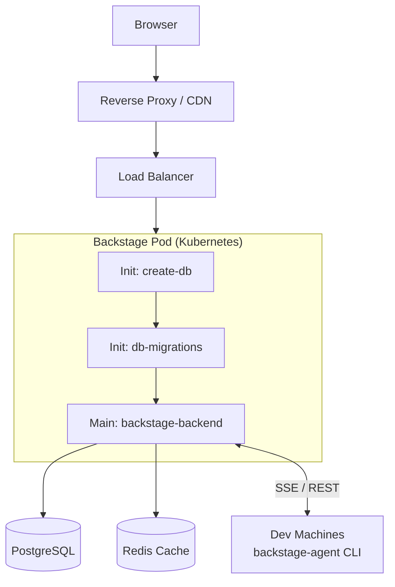

# Nexus IDP

A white-label Internal Developer Platform built on [Backstage](https://backstage.io). Nexus IDP provides a production-ready IDP with custom plugins for FinOps, Engineering Docs, Local Provisioning, and more — ready to deploy for any organization.

**Version:** 1.49.1 | **Node.js:** 20.x or 22.x | **Package manager:** Yarn 4.12.0 (Berry PnP)

---

## Table of Contents

- [Architecture](#architecture)
- [Custom Plugins](#custom-plugins)
- [Local Development](#local-development)
- [Production Deployment](#production-deployment)
- [Environment Variables](#environment-variables)
- [Tenant Configuration](#tenant-configuration)
- [Common Operations](#common-operations)
- [Troubleshooting](#troubleshooting)

---

## Architecture



**Auth:** Google OAuth with configurable domain restriction
**Permissions:** Custom RBAC — `backstage-admins` group has full access

---

## Custom Plugins

| Plugin | Location | Purpose |
|--------|----------|---------|
| `finops-backend` | `plugins/finops-backend/` | AWS cost data — Cost Explorer, Budgets, EC2/RDS/ELB/S3, multi-account |
| `finops` | `plugins/finops/` | FinOps dashboard — cost overview, budgets, unused resources, recommendations |
| `engineering-docs-backend` | `plugins/engineering-docs-backend/` | MDX documentation served from GitHub repositories |
| `engineering-docs` | `plugins/engineering-docs/` | Engineering docs viewer with TOC and nav sidebar |
| `local-provisioner-backend` | `plugins/local-provisioner-backend/` | Task queue, SSE stream, agent management, device code auth |
| `local-provisioner` | `plugins/local-provisioner/` | Frontend UI — task list, agent status |
| `project-registration` | `plugins/project-registration/` | Project wizard UI |
| `backstage-agent` | `packages/backstage-agent/` | CLI agent — runs on dev machines, executes provisioning tasks |
| `DeviceAuthPage` | `packages/app/src/components/` | Browser UI for OAuth device code flow (`/device` route) |
| `CustomTechRadarPage` | `packages/app/src/components/techRadar/` | Thoughtworks Tech Radar with auto-detected latest volume |

---

## Local Development

### Prerequisites

- Node.js 20.x or 22.x
- Yarn 4.12.0 (`corepack enable && corepack prepare yarn@4.12.0 --activate`)
- Docker & Docker Compose

### Setup

1. **Start local services:**
   ```bash
   docker compose up -d
   ```

2. **Run migrations (first time):**
   ```bash
   node scripts/run-migrations.js
   ```

3. **Create `app-config.local.yaml`:**
   ```yaml
   app:
     baseUrl: http://localhost:3000
   backend:
     baseUrl: http://localhost:7007
     cors:
       origin: http://localhost:3000
   auth:
     environment: development
     providers:
       google:
         development:
           clientId: ${AUTH_GOOGLE_CLIENT_ID}
           clientSecret: ${AUTH_GOOGLE_CLIENT_SECRET}
   ```

4. **Set environment variables:**
   ```bash
   export POSTGRES_HOST=localhost
   export POSTGRES_PORT=5432
   export POSTGRES_USER=backstage
   export POSTGRES_PASSWORD=backstage
   export POSTGRES_DB=backstage_plugin_local-provisioner
   export BACKEND_SECRET=$(node -p 'require("crypto").randomBytes(32).toString("hex")')
   export GITHUB_TOKEN=<your-pat>
   export AUTH_GOOGLE_CLIENT_ID=<client-id>
   export AUTH_GOOGLE_CLIENT_SECRET=<client-secret>
   export ORGANIZATION_NAME="Your Company"
   ```

5. **Install and start:**
   ```bash
   yarn install
   yarn dev
   ```
   Frontend: http://localhost:3000 | Backend: http://localhost:7007

---

## Production Deployment

### 1. PostgreSQL Setup

```sql
CREATE USER backstage WITH PASSWORD '<password>';
ALTER USER backstage CREATEDB;
```

### 2. Kubernetes Secret

```bash
kubectl create namespace backstage

kubectl create secret generic backstage-secrets \
  -n backstage \
  --from-literal=POSTGRES_PASSWORD=<password> \
  --from-literal=BACKEND_SECRET=<32-byte-hex> \
  --from-literal=AUTH_GOOGLE_CLIENT_ID=<client-id> \
  --from-literal=AUTH_GOOGLE_CLIENT_SECRET=<client-secret> \
  --from-literal=AUTH_GOOGLE_ALLOWED_DOMAINS=<your-domain.com> \
  --from-literal=ORGANIZATION_NAME="Your Company" \
  --from-literal=GITHUB_TOKEN=<github-pat>
```

### 3. Build & Push

```bash
yarn build:backend
docker build . -f Dockerfile.with-migrations --tag <your-registry>/nexus-idp:latest
docker push <your-registry>/nexus-idp:latest
```

Or one command:
```bash
REGISTRY=<your-registry>/nexus-idp ./scripts/deploy.sh
```

### 4. Helm Values

```yaml
replicaCount: 1

backstage:
  image:
    registry: "<your-registry>"
    repository: nexus-idp
    tag: "latest"
    pullPolicy: Always
  command: ["node", "packages/backend"]
  args: ["--config", "app-config.yaml", "--config", "app-config.production.yaml"]
  extraEnvVarsSecrets:
    - backstage-secrets
  extraEnvVars:
    - name: APP_BASE_URL
      value: "https://<your-domain>"
    - name: PORT
      value: "7007"
    - name: NODE_ENV
      value: "production"
    - name: POSTGRES_HOST
      value: "<postgres-host>"
    - name: POSTGRES_PORT
      value: "5432"
    - name: POSTGRES_USER
      value: "backstage"
    - name: POSTGRES_DB
      value: "backstage_plugin_local-provisioner"
  initContainers:
    - name: create-db
      image: "postgres:15"
      command: ["/bin/sh", "-c"]
      args:
        - PGPASSWORD=$POSTGRES_PASSWORD psql -h <postgres-host> -U backstage -d postgres -c "CREATE DATABASE \"backstage_plugin_local-provisioner\" OWNER backstage;" 2>/dev/null || true
      env:
        - name: POSTGRES_PASSWORD
          valueFrom:
            secretKeyRef:
              name: backstage-secrets
              key: POSTGRES_PASSWORD
    - name: db-migrations
      image: "<your-registry>/nexus-idp:latest"
      imagePullPolicy: Always
      workingDir: /app
      command: ["/bin/sh", "-c"]
      args: ["node scripts/run-migrations.js"]
      env:
        - name: POSTGRES_HOST
          value: "<postgres-host>"
        - name: POSTGRES_PORT
          value: "5432"
        - name: POSTGRES_USER
          value: "backstage"
        - name: POSTGRES_DB
          value: "backstage_plugin_local-provisioner"
        - name: POSTGRES_PASSWORD
          valueFrom:
            secretKeyRef:
              name: backstage-secrets
              key: POSTGRES_PASSWORD

service:
  type: LoadBalancer
  ports:
    backend: 80

postgresql:
  enabled: false
```

---

## Environment Variables

| Variable | Required | Description |
|----------|----------|-------------|
| `POSTGRES_HOST` | Yes | PostgreSQL host |
| `POSTGRES_PORT` | Yes | PostgreSQL port (default: 5432) |
| `POSTGRES_USER` | Yes | PostgreSQL user |
| `POSTGRES_PASSWORD` | Yes | PostgreSQL password |
| `POSTGRES_DB` | Yes | `backstage_plugin_local-provisioner` (hyphen, not underscore) |
| `BACKEND_SECRET` | Yes | 32-byte hex secret |
| `AUTH_GOOGLE_CLIENT_ID` | Yes | Google OAuth client ID |
| `AUTH_GOOGLE_CLIENT_SECRET` | Yes | Google OAuth client secret |
| `AUTH_GOOGLE_ALLOWED_DOMAINS` | Yes | Allowed email domain (e.g. `your-company.com`) |
| `ORGANIZATION_NAME` | Yes | Your organization display name |
| `GITHUB_TOKEN` | Yes | GitHub PAT for catalog and docs |
| `APP_BASE_URL` | Yes (prod) | Public URL (e.g. `https://idp.your-company.com`) |
| `NODE_ENV` | Yes (prod) | `production` |
| `REDIS_URL` | No | Redis URL — defaults to in-memory |
| `AWS_ACCESS_KEY_ID_<ACCOUNT>` | No | Per-account AWS key for FinOps |
| `AWS_SECRET_ACCESS_KEY_<ACCOUNT>` | No | Per-account AWS secret for FinOps |

---

## Tenant Configuration

Copy `example-org/` to your own folder and customize:

```bash
cp -r example-org my-company
```

Edit `my-company/org/groups.yaml` and `my-company/org/users.yaml` with your teams and users.

Then update `app-config.production.yaml` catalog location:
```yaml
catalog:
  locations:
    - type: file
      target: ./my-company/catalog-info.yaml
```

---

## Common Operations

### One-Command Deploy
```bash
REGISTRY=<your-registry>/nexus-idp ./scripts/deploy.sh
```

### Add a User
```yaml
apiVersion: backstage.io/v1alpha1
kind: User
metadata:
  name: firstname.lastname
spec:
  profile:
    email: firstname.lastname@your-company.com
    displayName: Firstname Lastname
  memberOf: [backend-team]   # add backstage-admins for admin access
```

### View Logs
```bash
kubectl logs -n backstage deployment/backstage -c backstage-backend --tail=100 -f
```

---

## Troubleshooting

| Symptom | Cause | Fix |
|---------|-------|-----|
| `Migration table is already locked` | Concurrent pod starts | Run `./scripts/clear-migration-locks.sh` |
| `database does not exist` | `create-db` init failed | Check init container logs; verify user has `CREATEDB` |
| Login redirect fails | `auth.environment` mismatch | Set `auth.environment: production` in production config |
| 401 on health endpoints | Auth policy missing | Verify `httpRouter.addAuthPolicy()` before `httpRouter.use()` |

---

## License

MIT
