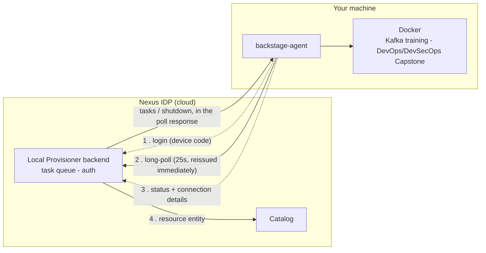

# Local Provisioner

The Local Provisioner lets you spin up guided training environments (Kafka, DevOps/DevSecOps
Capstone) on your own machine via Docker Compose — without needing to configure anything
manually.

---

## How It Works

1. You install the `backstage-agent` CLI on your machine
2. The agent connects to Nexus IDP and listens for provisioning tasks
3. You request a resource from the Nexus IDP UI
4. The agent runs the Docker Compose stack on your machine and reports status back

Your machine must be running and the agent must be active for provisioning to work.

---

## Architecture

The portal runs in the cloud; Docker runs on your laptop. Since the portal can't reach into your
machine, the agent **pulls** work: it holds a long-poll request (`GET /agent/poll`) open against
the backend, which responds the instant work exists — or after 25s if there's nothing to deliver
— and the agent immediately reissues the request. This single endpoint carries task delivery,
liveness (each call refreshes the agent's "last seen" timestamp — no separate heartbeat), and
shutdown signaling. There's no persistent streaming connection (SSE) — that was replaced with
this approach on 2026-07-26, because the Cloudflare tunnel in front of the portal doesn't
reliably hold a single connection open indefinitely, but handles many short, bounded requests
without issue.



Once a resource is running it needs **no internet** — it's local Docker. Only provisioning (the
one-time image pull) needs a connection. See the
[Local Provisioner Architecture](local-provisioner-architecture.md) doc for the full design
(task lifecycle, data model, catalog integration, security).

---

## Prerequisites

- Docker + Docker Compose installed and running (either `docker compose` v2 or the legacy
  `docker-compose` binary — the agent detects whichever is present)
- Node.js 20+
- Access to Nexus IDP (any authenticated user)

---

## Install the Agent

```bash
npm install -g @stratpoint/backstage-agent
```

---

## First-Time Login

The agent uses a device code flow (similar to GitHub CLI):

```bash
backstage-agent login
```

This will:
1. Print a user code (e.g. `ABCD-1234`)
2. Open your browser to the Nexus IDP device auth page
3. You enter the code and authenticate with Google
4. The agent saves a token to `~/.backstage-agent/config.json`

The token is valid for 7 days. When it expires, run `backstage-agent login` again.

---

## Start the Agent

`backstage-agent login` already starts the agent for you as a **background daemon** — it keeps
running after you close the terminal, so you stay online. You only need `start` if you stopped it:

```bash
backstage-agent start     # start the background daemon
backstage-agent status    # verify it's running and connected
backstage-agent stop      # stop it
```

---

## Provisioning a Resource

There is currently **no "Provision resource" dialog wired up in the portal** — an earlier version
of this page had one (`ProvisionDialog`), but it was reverted because it broke access to other
scaffolder templates and was never re-wired. Every resource today is provisioned via a
**scaffolder template**, reachable from the global **Create** page:

1. Go to **Create** in the sidebar, filter by the `training` tag (or search by name)
2. Pick a template: **Provision Kafka Training Environment Locally**, **Provision DevOps Capstone
   App Locally**, or **Provision DevSecOps Capstone App Locally**
3. Fill in the parameters and submit — this queues a task for your agent (via the
   `stratpoint:local-provision` scaffolder action)
4. Your agent picks it up on its next long-poll response (instantly if it's already waiting, which
   it normally is) and starts the Docker Compose stack on your machine
5. Status updates as it runs — go to **Local Provisioner** in the sidebar and click the task row
   to see live logs and connection details

Connection details (host, port, connection string) are shown in the task detail view once the
resource is running, with a copy button. The resource also appears in the **catalog** as a
`Resource` entity.

---

## Supported Resources

Only the three templates below are currently reachable. The agent's executor also has
support for plain, standalone Kafka/PostgreSQL/Redis/MongoDB (`templates/kafka`, `templates/postgres`,
`templates/redis`, `templates/mongodb`), but there is no template or UI path that provisions any
of them today — don't expect to find them in the portal.

| Resource | Template | Ports | Notes |
|----------|----------|-------|-------|
| Kafka (training) | `kafka-training-local` | Broker 9092, Zookeeper 2181, Kafka UI 8080, optional Schema Registry/Kafka Connect/Postgres/Prometheus/Grafana | Confluent Platform stack, not the standalone `bitnami/kafka` image — a genuinely different setup from any future plain "kafka" resource |
| DevOps Capstone (training) | `devops-capstone-training-local` | 3000 (frontend), 3001 (backend), 5432 (Postgres) | 3-tier task app, **built from source** on your machine (not a pulled image) — Phase 1 target for the [DevOps/DevSecOps Capstone training](https://github.com/strat-training/devops-capstone-local-provisioning) |
| DevSecOps Capstone (training) | `devsecops-capstone-training-local` | 3000 (frontend), 3001 (backend), 5432 (Postgres) | Same app, built from source — Phase 2 target for the same training, tracked as a separate resource from the Phase 1 one |

Each resource's exact connection string and published ports are shown in the portal's **task
detail view** (click a task row) with a copy button, and are stored locally in
`~/.backstage-agent/resources.json`.

> **Note on the two capstone resources:** these run three containers, so there's no single
> meaningful "connection string" — use the frontend and backend URLs directly
> (`http://localhost:<frontend port>` and `http://localhost:<backend port>`), both shown in the
> task detail view. They also require **agent 0.1.21+** — the template sends the app's source
> tree alongside the compose file (`task.config.sourceFiles`, base64-encoded); earlier agent
> versions only ever received the compose file text and fail with
> `unable to prepare context: path ".../app/backend" not found`. Run `backstage-agent update`
> if you're on an older version.

### Kafka (training)
The full Confluent Platform stack (broker, optional Zookeeper/Schema Registry/Kafka Connect/
monitoring) — see the `kafka-training-local` template's own parameters for what's configurable.

### DevOps Capstone / DevSecOps Capstone (training)
A 3-tier task management app (React frontend, Node.js/Express backend, PostgreSQL) — the target
environment for the [DevOps/DevSecOps Capstone
training](https://github.com/strat-training/devops-capstone-local-provisioning). Unlike Kafka
above, the frontend and backend images are **built from source** on your machine rather than
pulled — that's intentional, building the containers is part of the training. Provision
**DevOps Capstone** to start Phase 1, and **DevSecOps Capstone** to start Phase 2 — they run the
identical app but are tracked as separate resources so each phase's environment has its own
catalog entity and lifecycle. See the training repo's
[`local-provisioning/`](https://github.com/strat-training/devops-capstone-local-provisioning/tree/main/local-provisioning)
guide for the full walkthrough.

---

## Adding more resources & training environments

The catalog of provisionable resources is expected to grow — additional databases, message
brokers, observability stacks, and guided **training environments** (a resource plus a set of
exercises) are on the roadmap. Every resource today goes through a **scaffolder template**
reachable via the global **Create** page — see `kafka-training-local`,
`devops-capstone-training-local`, or `devsecops-capstone-training-local` in
[`engineering-standards`](https://github.com/your-github-org/engineering-standards)
`templates/training/` for the pattern (all three call the `stratpoint:local-provision` scaffolder
action). There's also an unused, dead-code `ProvisionDialog` component
(`plugins/local-provisioner/src/components/ProvisionDialog/`) from an earlier design that
provisioned resources directly from this page without a scaffolder step — it isn't wired into the
UI and shouldn't be treated as a second supported path unless someone deliberately re-wires it.

See the [Bench Engineer Usage Backlog](../bench-engineer-usage-backlog.md) (R-series) for
training-environment tasks, and the
[Local Provisioner Architecture](local-provisioner-architecture.md) doc for how templates,
task types, and the agent executor fit together.

---

## Stopping the Agent

The agent runs in the background, so `Ctrl+C` won't stop it — use:

```bash
backstage-agent stop
```

Stopping the agent does **not** stop your provisioned resources — they keep running on Docker.
Tear a resource down with `backstage-agent resource remove <name>` (or **Stop & remove** in the
portal).

---

## Where resources are stored (on your machine)

Everything the agent writes lives under **`~/.backstage-agent/`**:

```
~/.backstage-agent/
├── config.json          # your credentials (agent id, token)
├── resources.json       # local registry: resource name → folder, state, ports
├── outbox.json          # status updates queued while offline
└── tasks/
    └── <taskId>/
        ├── docker-compose.yml   # the compose file for that resource
        └── app/                 # capstone resources only — source the compose builds from
```

To find a resource's folder:

```bash
cat ~/.backstage-agent/resources.json     # maps each resource → its folder
ls ~/.backstage-agent/tasks/
```

**Compose file vs. data.** That folder holds the compose *definition*. The actual data (topics,
tables, keys…) lives in **Docker named volumes** (`docker volume ls`), not in the folder. That is
why **Stop & remove** runs `docker-compose down -v` — the `-v` deletes the data, so it asks you to
confirm.

You can manage a resource offline, straight from the CLI (no portal needed):

```bash
backstage-agent resources                        # list what you have
backstage-agent resource logs   <name>           # view logs
backstage-agent resource stop   <name>           # stop (keeps data)
backstage-agent resource start  <name>           # start again
backstage-agent resource remove <name>           # tear down (deletes data)
```

---

## Troubleshooting

| Symptom | Fix |
|---------|-----|
| `backstage-agent login` — browser doesn't open | Copy the URL printed in the terminal and open it manually |
| Token expired (after 7 days) | Run `backstage-agent login` again |
| Agent shows offline in the UI, but it's running | Check `backstage-agent status`; the backend considers an agent online for 90s after its last long-poll response — if it's been quiet longer than that, something's actually wrong with the poll loop |
| **Task stuck at `pending`** | Make sure the agent is running and current: `backstage-agent status`, `backstage-agent --version`, then `backstage-agent update`. Or use the task's ⋮ menu → **Re-send to agent** |
| `Poll error (offline?): <message>` in agent logs | Network issue reaching the portal (backend restart, connectivity blip). The agent retries automatically; running resources are unaffected |
| `Poll failed: 502/503` in agent logs | Transient (backend restarting); recovers automatically on the next poll. Running resources are unaffected |
| Task went to `failed` | Open the task → detail drawer for the error + logs, or `cd ~/.backstage-agent/tasks/<taskId>` and `docker compose logs` |
| Docker Compose fails | Check Docker is running: `docker info` |
| Port conflict | Find it (`lsof -i :9092`) and stop the conflicting service, or provision on a different port |
| Slow/no internet | Pre-pull images on a good connection: `backstage-agent prewarm <type>`. Once running, resources need no internet |
