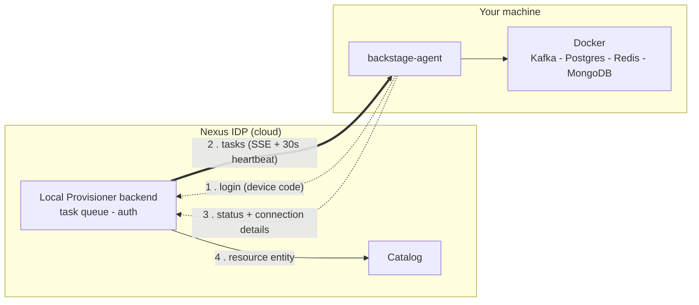

# Local Provisioner

The Local Provisioner lets you spin up development resources (Kafka, PostgreSQL, Redis, MongoDB) on your own machine via Docker Compose — without needing to configure anything manually.

---

## How It Works

1. You install the `backstage-agent` CLI on your machine
2. The agent connects to Nexus IDP and listens for provisioning tasks
3. You request a resource from the Nexus IDP UI
4. The agent runs the Docker Compose stack on your machine and reports status back

Your machine must be running and the agent must be active for provisioning to work.

---

## Architecture

The portal runs in the cloud; Docker runs on your laptop. Since the portal can't reach into your
machine, the agent **pulls** work: it opens an outbound connection, and the backend delivers
tasks over it. The agent listens on a live stream (SSE) for instant delivery, and — because a
proxy (e.g. a Cloudflare tunnel) can buffer SSE — task delivery is also folded into the agent's
regular heartbeat (every 30s), a plain request/response that works through any proxy. So a task
arrives instantly when SSE is healthy, and within ~30s otherwise.



Once a resource is running it needs **no internet** — it's local Docker. Only provisioning (the
one-time image pull) needs a connection. See the
[Local Provisioner Architecture](local-provisioner-architecture.md) doc for the full design
(task lifecycle, data model, catalog integration, security).

---

## Prerequisites

- Docker + Docker Compose installed and running (either `docker compose` v2 or the legacy
  `docker-compose` binary — the agent detects whichever is present)
- Node.js 20+
- Access to Nexus IDP (any authenticated user)

---

## Install the Agent

```bash
npm install -g @stratpoint/backstage-agent
```

---

## First-Time Login

The agent uses a device code flow (similar to GitHub CLI):

```bash
backstage-agent login
```

This will:
1. Print a user code (e.g. `ABCD-1234`)
2. Open your browser to the Nexus IDP device auth page
3. You enter the code and authenticate with Google
4. The agent saves a token to `~/.backstage-agent/config.json`

The token is valid for 7 days. When it expires, run `backstage-agent login` again.

---

## Start the Agent

`backstage-agent login` already starts the agent for you as a **background daemon** — it keeps
running after you close the terminal, so you stay online. You only need `start` if you stopped it:

```bash
backstage-agent start     # start the background daemon
backstage-agent status    # verify it's running and connected
backstage-agent stop      # stop it
```

---

## Provisioning a Resource

1. Go to **Local Provisioner** in the sidebar
2. Click **Provision resource** (opens the scaffolder templates) and pick a resource type:
   `kafka`, `postgres`, `redis`, or `mongodb`
3. The task is queued for your agent
4. Your agent picks it up (instantly via SSE, or within ~30s) and starts the Docker Compose stack on your machine
5. Status updates as it runs — click a task row to see live logs and connection details

Connection details (host, port, connection string) are shown in the task detail view once the
resource is running, with a copy button. The resource also appears in the **catalog** as a
`Resource` entity.

---

## Supported Resources

| Resource | Default Port | Connection string | Notes |
|----------|-------------|-------------------|-------|
| PostgreSQL | 5432 | `postgresql://localhost:5432` | Relational database; default db `dev` |
| Redis | 6379 | `redis://localhost:6379` | In-memory cache/store; no auth by default |
| Kafka | 9092 | `localhost:9092` | Event streaming; includes Zookeeper + a UI on `:8080` |
| MongoDB | 27017 | `mongodb://localhost:27017` | Document database; no auth by default |

Each resource's exact connection string and published ports are shown in the portal's **task
detail view** (click a task row) with a copy button, and are stored locally in
`~/.backstage-agent/resources.json`. Configuration (port, version) can be set when you provision.

### PostgreSQL
A standard PostgreSQL instance for local app development and testing. Connect with `psql`, a
driver, or any GUI (TablePlus, DBeaver) at `localhost:5432`.

### Redis
A Redis instance for caching, sessions, queues, or pub/sub. Connect with `redis-cli` or any
client at `localhost:6379`.

### Kafka
A single-broker Kafka + Zookeeper stack for event-streaming development, plus a web UI at
`http://localhost:8080` to browse topics and messages. Point producers/consumers at
`localhost:9092`.

### MongoDB
A MongoDB instance for document-oriented development. Connect with `mongosh` or a driver at
`mongodb://localhost:27017`.

---

## Adding more resources & training environments

The catalog of provisionable resources is expected to grow — additional databases, message
brokers, observability stacks, and guided **training environments** (a resource plus a set of
exercises) are on the roadmap.

Resources come from **scaffolder templates** in the
[`engineering-standards`](https://github.com/stratpoint-engineering/engineering-standards) repo
(`templates/training/`). To add a new one:

1. Add a training template (a `template.yaml` that renders a `docker-compose.yml` and calls the
   `stratpoint:local-provision` scaffolder action).
2. For a genuinely new resource *type*, add a matching bundled compose template to the agent
   (`packages/backstage-agent/templates/<type>/`) and register the task type in the backend.
3. It then appears automatically under **Provision resource → training templates**.

See the [Bench Engineer Usage Backlog](../bench-engineer-usage-backlog.md) (R-series) for
training-environment tasks, and the
[Local Provisioner Architecture](local-provisioner-architecture.md) doc for how templates,
task types, and the agent executor fit together.

---

## Stopping the Agent

The agent runs in the background, so `Ctrl+C` won't stop it — use:

```bash
backstage-agent stop
```

Stopping the agent does **not** stop your provisioned resources — they keep running on Docker.
Tear a resource down with `backstage-agent resource remove <name>` (or **Stop & remove** in the
portal).

---

## Where resources are stored (on your machine)

Everything the agent writes lives under **`~/.backstage-agent/`**:

```
~/.backstage-agent/
├── config.json          # your credentials (agent id, token)
├── resources.json       # local registry: resource name → folder, state, ports
├── outbox.json          # status updates queued while offline
└── tasks/
    └── <taskId>/
        └── docker-compose.yml   # the compose file for that resource
```

To find a resource's folder:

```bash
cat ~/.backstage-agent/resources.json     # maps each resource → its folder
ls ~/.backstage-agent/tasks/
```

**Compose file vs. data.** That folder holds the compose *definition*. The actual data (topics,
tables, keys…) lives in **Docker named volumes** (`docker volume ls`), not in the folder. That is
why **Stop & remove** runs `docker-compose down -v` — the `-v` deletes the data, so it asks you to
confirm.

You can manage a resource offline, straight from the CLI (no portal needed):

```bash
backstage-agent resources                        # list what you have
backstage-agent resource logs   <name>           # view logs
backstage-agent resource stop   <name>           # stop (keeps data)
backstage-agent resource start  <name>           # start again
backstage-agent resource remove <name>           # tear down (deletes data)
```

---

## Troubleshooting

| Symptom | Fix |
|---------|-----|
| `backstage-agent login` — browser doesn't open | Copy the URL printed in the terminal and open it manually |
| Token expired (after 7 days) | Run `backstage-agent login` again |
| Agent shows offline in the UI, but it's running | It's a heartbeat gap — check `backstage-agent status`; the UI marks online within ~60s of a heartbeat |
| **Task stuck at `pending`** | Make sure the agent is running and current: `backstage-agent status`, `backstage-agent --version`, then `backstage-agent update`. Or use the task's ⋮ menu → **Re-send to agent** |
| `SSE connection error: <none>` in agent logs | Harmless — task delivery also rides the 30s heartbeat (a plain request/response that works through proxies), so tasks still arrive. If tasks run, ignore it |
| `Heartbeat failed: 502/503` | Transient (backend restarting); recovers automatically. Running resources are unaffected |
| Task went to `failed` | Open the task → detail drawer for the error + logs, or `cd ~/.backstage-agent/tasks/<taskId>` and `docker compose logs` |
| Docker Compose fails | Check Docker is running: `docker info` |
| Port conflict | Find it (`lsof -i :9092`) and stop the conflicting service, or provision on a different port |
| Slow/no internet | Pre-pull images on a good connection: `backstage-agent prewarm <type>`. Once running, resources need no internet |
