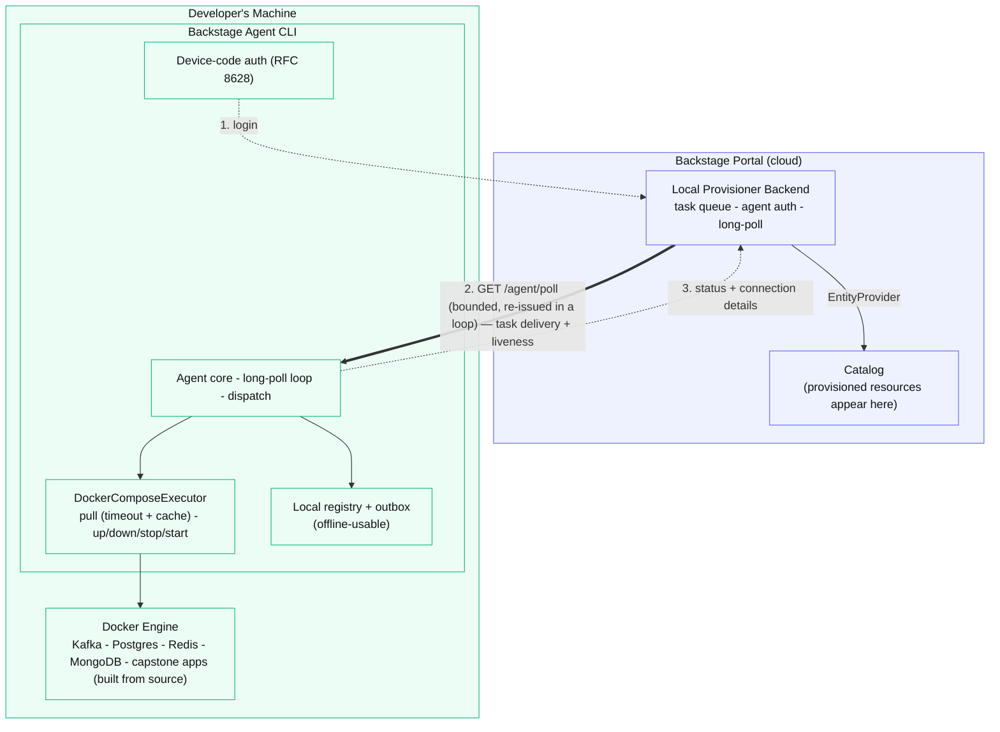

# Backstage Agent

[](https://www.npmjs.com/package/@stratpoint/backstage-agent)
[](LICENSE)
[](https://nodejs.org)

Local Provisioner Agent for Backstage - Provisions local development resources using Docker Compose.

## Overview

The Backstage Agent is a CLI tool that runs on a developer's machine to provision local development resources (Kafka, PostgreSQL, Redis, etc.) as requested from the Backstage portal. It connects to the Backstage backend via HTTP long-polling to receive provisioning tasks in real-time.

## Features

- **Device-code authentication** (RFC 8628) — reuses Backstage Google OAuth, no manual token copy/paste
- **Real-time task reception** via HTTP long-polling (a parked poll wakes instantly when work is queued; no SSE, no fixed-interval heartbeat — see Architecture below)
- **Full resource lifecycle** — provision, stop, start, restart, and tear down (Kafka, PostgreSQL, Redis, MongoDB)
- **Offline & slow-internet resilience:**
  - Image pulls with progress + a hard timeout (never hangs); cached images skip the pull → fully offline provisioning
  - `prewarm` to pull images ahead of time on a good connection
  - Local resource registry + offline management CLI (`resources`, `resource stop|start|restart|logs|remove`)
  - Offline outbox — status updates queued when the portal is unreachable, flushed on reconnect
- **Self-update** — `backstage-agent update`, plus an update-available notice on start
- **Connection details reported** back to the portal ("how to connect")
- Graceful shutdown, comprehensive logging

## Prerequisites

- **Node.js**: 20.x or higher (18 is end-of-life; the platform uses 22.x)
- **Docker**: Installed and running
- **Docker Compose**: Installed (`docker compose` v2 or legacy `docker-compose` — the agent
  detects whichever is available)
- **Backstage Instance**: Running with Local Provisioner plugin

## Installation

### Global Installation (Recommended)

Install the agent globally using npm:

```bash
npm install -g @stratpoint/backstage-agent
```

Or using yarn:

```bash
yarn global add @stratpoint/backstage-agent
```

### Verify Installation

```bash
backstage-agent --version
backstage-agent --help
```

### From Source (Development)

If you're developing the agent or want to install from the monorepo:

```bash
# Clone the repository
git clone https://github.com/stratpoint-engineering/backstage-main.git
cd backstage-main/packages/backstage-agent

# Install dependencies
yarn install

# Build the package
yarn build

# Link for local testing
npm link
```

## Configuration & local storage

Everything the agent writes lives under **`~/.backstage-agent/`**:

```
~/.backstage-agent/
├── config.json          # credentials: backstageUrl, agentId, serviceToken, expiresAt
├── resources.json       # local registry of provisioned resources (name → taskDir, state, ports)
├── outbox.json          # status updates queued while offline (created on demand)
├── agent.pid            # PID of the running daemon
└── tasks/
    └── <taskId>/
        └── docker-compose.yml   # the rendered compose file for that resource
```

**`config.json`** (permissions `600`, owner-only):

```json
{
  "backstageUrl": "https://your-backstage-instance",
  "agentId": "agent-your-machine",
  "serviceToken": "…",
  "expiresAt": 1735228800000
}
```

**Where a resource's files are.** Each provisioned resource has its `docker-compose.yml` in
`~/.backstage-agent/tasks/<taskId>/`. To find a resource's folder:

```bash
cat ~/.backstage-agent/resources.json    # maps each resource name → its taskDir
# or
ls ~/.backstage-agent/tasks/
```

**Compose definition vs. data.** That folder holds the compose *definition*, not the data. The
actual data (Kafka topics, Postgres tables, etc.) lives in **Docker named volumes** managed by
Docker — see `docker volume ls`. This is why **Stop & remove** / `resource remove` runs
`docker-compose down -v`: the `-v` deletes those volumes, which is why it asks for confirmation.

You can work with a resource directly from its folder — the same commands the offline CLI wraps:

```bash
cd ~/.backstage-agent/tasks/<taskId>/
docker compose ps          # containers for this resource
docker compose logs        # logs (also shown in the portal task detail view)
```

## Usage

### Command reference

| Command | What it does | Needs internet |
|---------|--------------|:---:|
| `login --url <url>` | Authenticate via device-code flow (opens browser, enter the code, sign in with Google) | yes |
| `start` | Start the agent daemon; long-polls for tasks | yes |
| `stop` | Stop the running agent daemon | no |
| `status` | Show agent + connection status | yes |
| `logout` | Clear credentials and stop the agent | no |
| `resources` | List locally-provisioned resources | **no** |
| `resource stop\|start\|restart\|logs\|remove <name>` | Manage a resource's lifecycle locally | **no** |
| `prewarm <type>` | Pre-pull a resource type's images for later offline provisioning | yes |
| `update [--check]` | Update the agent to the latest published version | yes |

### Login

```bash
backstage-agent login --url https://your-backstage-instance
```

Prints a short code, opens the portal's `/device` page — enter the code and sign in with Google.
The token is saved to `~/.backstage-agent/config.json` and the agent auto-starts. Tokens are
valid for 7 days; re-run `login` when one expires.

### Start

```bash
backstage-agent start
```

Loads credentials, checks Docker, and starts long-polling for tasks. On start it also checks
for a newer agent version and prints a one-line notice if one is available.

### Stop

```bash
backstage-agent stop
```

### Managing resources offline

Once a resource is provisioned it runs entirely on local Docker — no internet needed. Manage it
with the local CLI even when the portal is unreachable:

```bash
backstage-agent resources                     # list what's provisioned locally
backstage-agent resource logs my-kafka        # tail logs
backstage-agent resource stop my-kafka        # stop (keeps data)
backstage-agent resource start my-kafka       # start again
backstage-agent resource remove my-kafka      # tear down (deletes containers + volumes)
```

### Slow or no internet

Provisioning needs a one-time image pull. To provision offline later, pull ahead of time on a
good connection:

```bash
backstage-agent prewarm kafka                 # then you can provision kafka offline from cache
```

If the portal is unreachable while a task completes, the status is queued and delivered on the
next successful poll — nothing is lost.

### Updating

```bash
backstage-agent update            # update to the latest version
backstage-agent update --check    # check only, don't install
```

## Task Execution Flow

1. **Task Received**: Agent picks up the task from its long-poll response
   ```
   2024-12-26 10:06:00 - info: Picked up task task-123 via poll
   2024-12-26 10:06:00 - info: Processing task task-123
   ```

2. **Status Update**: Agent updates task status to `in-progress`

3. **Docker Compose Generation**: Agent generates `docker-compose.yml` from template
   ```
   2024-12-26 10:06:01 - info: Docker Compose file written to: /Users/developer/.backstage-agent/tasks/task-123/docker-compose.yml
   ```

4. **Resource Provisioning**: Agent executes `docker-compose up -d`
   ```
   2024-12-26 10:06:02 - info: Starting Docker Compose for resource: my-kafka
   2024-12-26 10:06:10 - info: All 2 containers are running
   ```

5. **Completion**: Agent reports success or failure
   ```
   2024-12-26 10:06:11 - info: Task task-123 completed successfully
   ```

## Supported Resources

The agent's executor and bundled compose templates (`templates/kafka`, `templates/postgres`,
`templates/redis`, `templates/mongodb`) support plain Kafka, PostgreSQL, Redis, and MongoDB —
but **none of these four are currently reachable from the portal.** The dialog that once exposed
them (`ProvisionDialog`) was reverted to unused/dead code, and there is no active scaffolder
template for any of them today. They exist as agent/backend capability, not a live user-facing
feature — don't advertise them as available until a template or UI path is actually wired up.

### Kafka (training)

The only Kafka path currently reachable from the portal is `kafka-training` (a distinct task
type from plain `kafka` above), provisioned via the `kafka-training-local` scaffolder template.
Full Kafka + Zookeeper + optional Schema Registry/Kafka Connect/Postgres/monitoring stack — see
that template for its actual parameters (kafka version, ports, etc.).

### Capstone training apps (`devops-capstone-training`, `devsecops-capstone-training`)

Unlike the four resources above, these build a custom 3-tier app (React frontend, Node/Express
backend, Postgres) **from source** rather than pulling a public image. Scaffolder-only (not
reachable from the Provision resource dialog) — the template sends the app's source tree
alongside the rendered `docker-compose.yml` as a base64-encoded file map
(`task.config.sourceFiles`), which the agent writes into the task directory before running
`docker compose up`. Requires 0.1.21+ — earlier versions only ever received the compose file
text and fail with `unable to prepare context: path ".../app/backend" not found`.

## Architecture



**Offline note:** once a resource is running, the *Local* half operates with no connection to the
portal — the local registry and the `resource` commands manage it entirely on-machine. Status
updates that cannot reach the portal are held in the outbox and delivered on reconnect.

## File Structure

```
packages/backstage-agent/
├── bin/
│   └── backstage-agent.js        # CLI entry point (executable)
├── src/
│   ├── agent/
│   │   └── Agent.ts              # Main agent coordinator + long-poll loop
│   ├── auth/
│   │   ├── GoogleAuthClient.ts   # OAuth flow handler
│   │   └── TokenManager.ts       # Token storage
│   ├── commands/
│   │   ├── login.ts              # Device-code login
│   │   ├── start.ts / stop.ts    # Daemon lifecycle
│   │   ├── status.ts / logout.ts
│   │   ├── resources.ts          # Offline resource list + lifecycle CLI
│   │   ├── prewarm.ts            # Pre-pull images for offline use
│   │   └── update.ts             # Self-update
│   ├── config/
│   │   └── ConfigManager.ts      # Config file management
│   ├── executor/
│   │   └── DockerComposeExecutor.ts # Docker lifecycle (pull/up/down/stop/start)
│   ├── registry/
│   │   ├── LocalResourceRegistry.ts # Offline resource registry
│   │   └── OutboxQueue.ts        # Offline status-update queue
│   ├── utils/
│   │   ├── logger.ts             # Winston logger
│   │   └── versionCheck.ts       # Self-update version check
│   ├── cli.ts                    # CLI setup
│   ├── index.ts                  # Main exports
│   └── types.ts                  # TypeScript types
├── templates/
│   └── kafka/
│       └── docker-compose.yml    # Kafka template
├── package.json
├── tsconfig.json
└── README.md
```

## Environment Variables

The agent supports these environment variables:

- `LOG_LEVEL`: Logging level (default: `info`)
  - Options: `error`, `warn`, `info`, `debug`
  - Example: `LOG_LEVEL=debug backstage-agent start`

## Troubleshooting

### Authentication Issues

**Problem**: "No configuration found"

**Solution**: Run `backstage-agent login --url <backstage-url>` first

---

**Problem**: "Authentication token has expired"

**Solution**: Run `backstage-agent login --url <backstage-url>` again

---

**Problem**: Browser doesn't open

**Solution**: Copy the URL from the terminal and open it manually

---

### Docker Issues

**Problem**: "Docker is not available or not running"

**Solution**:
1. Install Docker Desktop
2. Start Docker Desktop
3. Verify with `docker ps`

---

**Problem**: "Docker containers failed to start"

**Solution**:
1. Check Docker logs: `docker-compose logs` in task directory
2. Ensure ports are not already in use
3. Check Docker resources (CPU, memory)

---

### Connection Issues

**Occasional `Poll failed: 502` / `503` in the logs**

Transient — usually the backend restarting (a deploy). The agent backs off briefly and re-issues
the poll; task delivery, the shutdown signal, and liveness are all carried on this same
long-poll loop (no separate SSE stream, no fixed-interval heartbeat, as of 0.1.20). Your running
resources are unaffected; they run locally on Docker regardless of portal connectivity.

---

### Task Execution Issues

**Task stays `pending` and never starts**

The agent isn't picking it up. Check, in order:

1. **Is the agent running and current?** `backstage-agent status` and `backstage-agent --version`
   (must be the latest — `backstage-agent update`). Versions before 0.1.20 used SSE + a heartbeat
   fallback, which could miss tasks behind a proxy that buffers/kills long-lived connections.
2. **Start it:** `backstage-agent start`. On start it polls immediately, so a queued task begins
   within a few seconds.
3. **Re-send from the portal:** the task's ⋮ menu → **Re-send to agent**.
4. **Right agent?** If you have more than one machine registered, make sure the task targets the
   one that's running.

---

**Task went to `failed`**

Open the task in the portal (row → detail drawer) to read the error and logs, or locally:

```bash
cd ~/.backstage-agent/tasks/<taskId>/
docker compose logs
```

Common causes: a port already in use (`lsof -i :9092`), or Docker low on resources.

---

**A resource is gone from the portal but containers are still running (or vice-versa)**

List and reconcile locally:

```bash
backstage-agent resources                 # what the agent thinks exists
docker ps                                 # what's actually running
backstage-agent resource remove <name>    # stop + delete containers and volumes
```

---

## Development

### Building

```bash
yarn build
```

### Development Mode

```bash
yarn dev  # Watch mode
```

### Testing Locally

```bash
# Build
yarn build

# Link globally
npm link

# Test commands
backstage-agent login --url http://localhost:7007
backstage-agent start
```

### Adding New Resource Templates

1. Create directory: `templates/{resource-name}/`
2. Add `docker-compose.yml` with Mustache variables:
   ```yaml
   version: '3.8'
   services:
     {{resourceName}}:
       image: ...
       ports:
         - "{{port}}:{{port}}"
   ```
3. Update `DockerComposeExecutor.getTemplateForTaskType()` mapping
4. Update backend task types

## Security Considerations

- Tokens stored in `~/.backstage-agent/config.json` (user-only access)
- HTTPS recommended for production
- Service tokens expire (configurable in backend)
- Google OAuth domain restriction (`@example.com`)

## Contributing

1. Fork the repository
2. Create a feature branch
3. Make changes with tests
4. Submit pull request

## License

Apache-2.0

## Support

For issues or questions:
- File GitHub issue
- Contact DevOps team
- Check Backstage documentation

---

**Version**: 0.1.21
**Last Updated**: 2026-07-28
